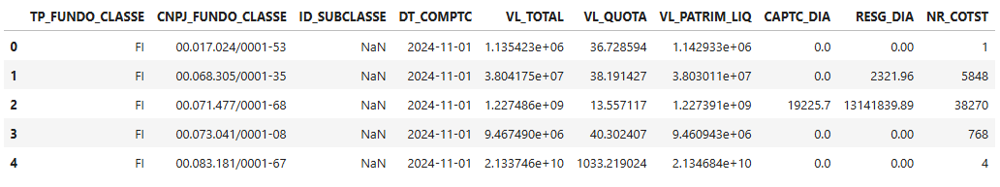

# CVM Data Reader

## Introduction
The **CVM Data Processor** project provides tools to read and process datasets from the **Comissão de Valores Mobiliários (CVM)**, including:
- **Fundos de Investimento (FI)**: Informe Diário, Composição e Diversificação de Aplicações.
- **Companhias**: ITR (Quarterly Information), DFP (Financial Statements), among others.

## Installation

Clone the repository:

```bash
git clone https://github.com/username/cvm-data-processor.git
cd cvm-data-processor
```

Create a virtual environment and activate it:

```bash
python -m venv venv
source venv/bin/activate  # Linux/Mac
venv\Scripts\activate  # Windows
```

Install dependencies:

```bash
pip install -r requirements.txt
```

---

## Usage

### Example: Processing Investment Fund Data

For fetching historical data, we use fetch_historical_data() method.
For fetching static data, we use fetch_static_data() method. 

Availables datasets are:
    cadastro, extrato, registro_fundo_classe, informe_diario, composicao_diversificacao, balancete, perfil_mensal 

```python
import cvm

# Instance FI datasets
fi = FI()

# Load data
fi.fetch_static_data("cadastro")
fi.fetch_historical_data("informe_diario", "2024-11-05", "2024-12-23")
```

Datasets will be attributes of the FI instance.

```python
fi.informe_diario.inf_diario_fi.head()
```

